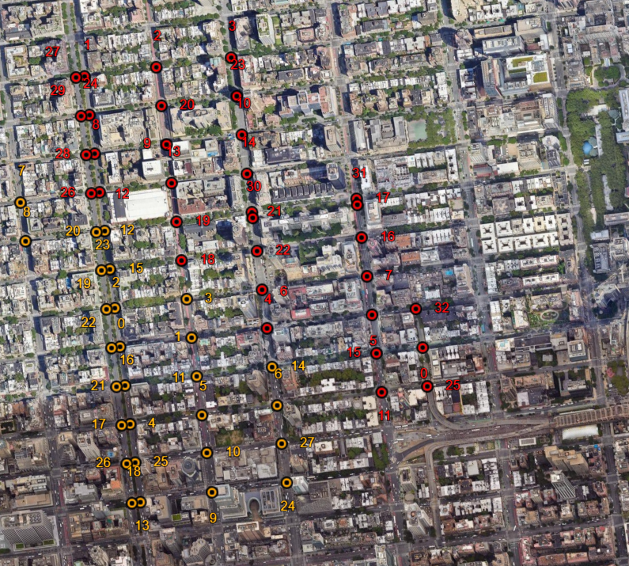

# seurat

Simple dot-map generator.

## Quickstart

Download [Python 3.12.5](https://www.python.org/downloads/release/python-3125/). Almost certainly works on many other version of Python, but that has not been tested.

Clone the repository and install Python dependencies.

```sh
git clone https://github.com/mdhiebert/seurat.git
cd seurat
pip install -r requirements.txt
```

Helptext:

```sh
 ...\seurat> python seurat.py --help
usage: seurat [-h] [-n NUM_CLUSTERS] [-o OUTPUT] north_latitude west_longitude south_latitude east_longitude

simple tool to generate dot-maps

positional arguments:
  north_latitude
  west_longitude
  south_latitude
  east_longitude

options:
  -h, --help            show this help message and exit
  -n NUM_CLUSTERS, --num_clusters NUM_CLUSTERS
  -o OUTPUT, --output OUTPUT

ex. python seurat.py 40.768402 -73.968350 40.761245 -73.961197 -n 2 -o nyc.kml
```

Running the example script (`python seurat.py 40.768402 -73.968350 40.761245 -73.961197 -n 2 -o nyc.kml`) runs the generator with the following properties:

- Northern latitude line of `40.768402`
- Western longitude line of `-73.968350`
- Southern latitude line of `40.761245`
- Eastern longitude line of `-73.961197`
- Specifies the number of clusters (unique colors) `n` as `2`
- Sets the output KML file to `nyc.kml`

The result looks as follows:



## Caution

This tool runs off of the [OpenStreetMaps](https://www.openstreetmap.org) [Overpass API](https://wiki.openstreetmap.org/wiki/Overpass_API). Do not overwhelm the open-source database with insanely large bounding boxes or overly frequent calls.